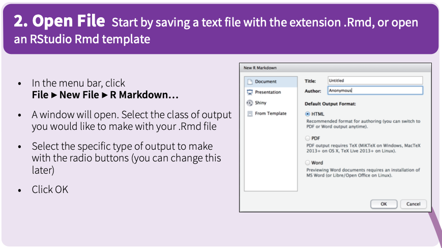
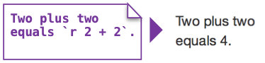
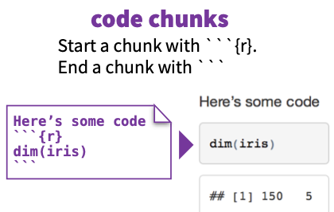
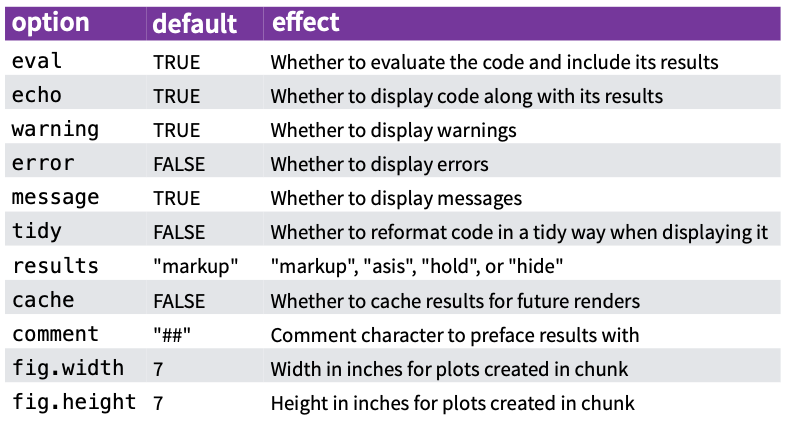

# Creating a new `Rmd`

To lead off, there is an excellent 
[`Rmd` cheat sheet](https://raw.githubusercontent.com/rstudio/cheatsheets/main/rmarkdown.pdf) 
that RStudio has published. I leverage it here for examples, but I also refer to 
it all the time for work.

As a side note, there are many 
[cheat sheets](https://www.rstudio.com/resources/cheatsheets/) on the RStudio 
website. I encourage you to leverage these!

## Opening a new file

<center>
  
</center>

## YAML Header

This tells RStudio some basic information about the Markdown document and what 
to do when rendering the file (more on that below). 

### This is a Basic YAML Header

```
---
title: "Intro to RMarkdown"
author: "Jake Rozran"
date: "1/9/2022"
output: html_document
---
```

`title` is the title of the document.  
`author` is the author of the document.  
`date` is the date the document was created. I sometimes make this dynamic by 
changing this to the following (more on this below): 
```{r date, eval = FALSE}
date: "`r Sys.Date()`"
```

The two other output options we _can_ use in this class are word documents and 
pdf documents:

`output: pdf_document` (*Note: Requires LaTeX to be installed; not required for *
*this class.*)  
`output: word_document` (*Note: Will work even if Word is not installed.*)

### Adding TOC (Optional)

I like to add a table of contents to my files, especially when they are getting 
long.

```
---
title: "Intro to RMarkdown"
author: "Jake Rozran"
date: "1/9/2022"
output: 
    html_document:
        toc: true
        toc_float: 
            smooth_scroll: true
            collapsed: true
---
```

With floating, the TOC will "float" on the left side of the document. Otherwise, 
it will be at the top. 

# How to Write `md`

Markdown is actually a language of its own - it is fairly straightforward and 
helps style the text of your document. 

## `md` "Code"

```
Plain text  
End a line with two spaces to start a new paragraph.  
*italics* and _italics_  
**bold** and __bold__  
superscript^2^  
~~strikethrough~~  
[link](www.rstudio.com)  
`inline code`  
\```
code chunk
with lots of lines
\```  

# Header 1

## Header 2

### Header 3

#### Header 4

##### Header 5

###### Header 6

endash: --  
emdash: ---  
ellipsis: ...  
inline equation: $A = \pi*r^{2}$  

horizontal rule (or slide break):  

***  

> block quote  

* unordered list
* item 2
    + sub-item 1
    + sub-item 2

1. ordered list
2. item 2
    + sub-item 1
    + sub-item 2

Table Header  | Second Header
------------- | -------------
Table Cell    | Cell 2
Cell 3        | Cell 4
```

## `md` Rendered

Plain text  
End a line with two spaces to start a new paragraph.  
*italics* and _italics_  
**bold** and __bold__  
superscript^2^  
~~strikethrough~~  
[link](www.rstudio.com)  
`inline code`  
```
code chunk
with lots of lines
```  

# Header 1 {.unlisted .unnumbered}

## Header 2 {.unlisted .unnumbered}

### Header 3 {.unlisted .unnumbered}

#### Header 4 {.unlisted .unnumbered}

##### Header 5 {.unlisted .unnumbered}

###### Header 6 {.unlisted .unnumbered}

endash: --  
emdash: ---  
ellipsis: ...  
inline equation: $A = \pi*r^{2}$  

horizontal rule (or slide break):  

***  

> block quote  

* unordered list
* item 2
    + sub-item 1
    + sub-item 2

1. ordered list
2. item 2
    + sub-item 1
    + sub-item 2

Table Header  | Second Header
------------- | -------------
Table Cell    | Cell 2
Cell 3        | Cell 4

# The `R` in `Rmd`

The reason we use `Rmd` docs is so that we can run actual `R` code both in the 
markdown (inline) and in embeded code "chunks."

## Inline `R` code

You can run `R` code in line by using a tick followed by an r and then your 
r code, and then finally a last tick.  

<center>

</center>

Two plus two equals `r 2 + 2`.

## Embedded `R` Code Chunks

Additionally, you can create whole chunks of `R` code in your Rmd. 

<center>

</center>

```{r name_of_chunk}
# Here we can run any R code and  have it output the results

4 + 4
2 ^ 3
"cat" %in% c("cat", "dog", "mouse")
```

You can also do plots:

```{r another_chunk}
hist(rnorm(1000))
```

### Code Chunk Options

There are also options for each chunk that will allow you to present your 
results in different ways. 

<center>

</center>