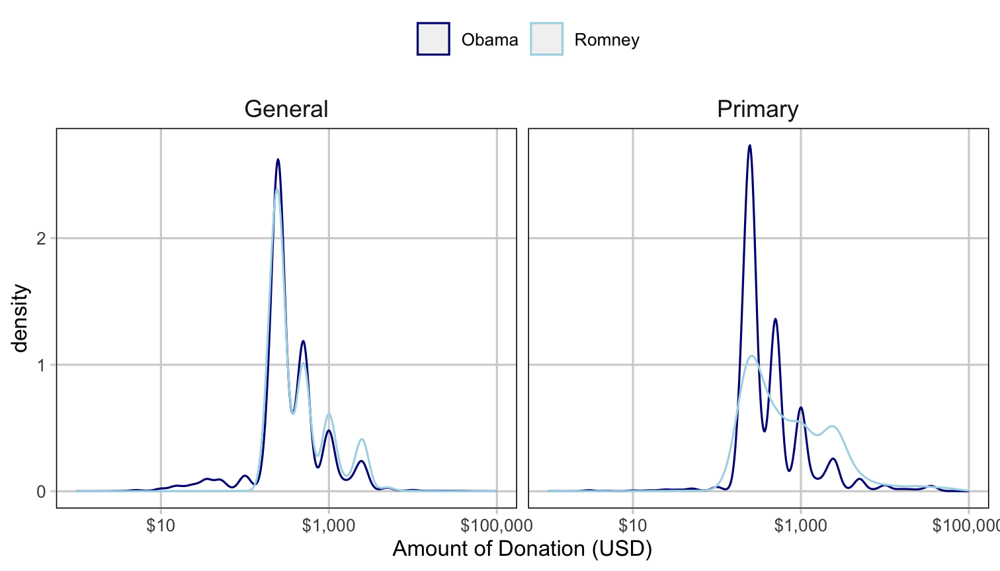

```{r setup, include = FALSE}
options(htmltools.dir.version = FALSE)
knitr::opts_chunk$set(fig.retina = 3, 
                      warning = FALSE, 
                      message = FALSE, 
                      echo = FALSE)
library(dplyr)
library(tidyr)
library(ggplot2)
library(mdsr)
```

```{r xaringan-themer, include = FALSE, warning = FALSE}
library(xaringanthemer)
style_duo_accent(primary_color = "#035AA6", 
                 secondary_color = "#03A696",
                 code_font_size = "0.5rem")
```

class: top, left

# Coordinate Systems

How are the data points organized? 

Here are the most common: 

- **Cartesian**: The familiar (x, y)-rectangular coordinate system with two 
perpendicular axes.
- **Polar**: The radial analog of the Cartesian system with points identified by 
their radius ρ and angle θ.
- **Geographic**: The increasingly important system in which we have locations on 
the curved surface of the Earth, but we are trying to represent these locations 
in a flat two-dimensional plane. 

An appropriate choice for a coordinate system is critical in representing one’s 
data accurately, since, for example, displaying geospatial data like airline 
routes on a flat Cartesian plane can lead to gross distortions of reality.

---

class: top, left

# Scale

The central question is how does distance in the data graphic translate into 
meaningful differences in quantity?

- Scales translate into visual cues
- The choice of scale is crucial
- There are three choices:
    - Numeric (linear, logarithmic, and percentage)
    - Categorical (both ordinal and non-ordinal)
    - Time (can be split by year, months, weeks, days, hours, minutes, seconds...)
    
**Note: it is VERY easy to mislead with scale by distorting the relative **
**positions of data.**

---

### Lying with Scale


.pull-left[

The original - we can see in absolute terms how different each species is.

```{r position_code_2, out.width = "100%", fig.height = 4}
plot_dat <- iris %>%
    group_by(Species) %>% 
    summarise(avg_sepal_length = mean(Sepal.Length))

ggplot(plot_dat, aes(x = Species, y = avg_sepal_length)) + 
    geom_bar(stat = "identity")
```
]

--

.pull-right[

The lie - now, at a quick glance, it seems that **setosa** is much smaller than 
the other two species.

```{r position_code_lie, echo = TRUE, out.width = "100%", fig.height = 4}
plot_dat <- iris %>%
    group_by(Species) %>% 
    summarise(avg_sepal_length = mean(Sepal.Length))

ggplot(plot_dat, aes(x = Species, y = avg_sepal_length)) + 
    geom_bar(stat = "identity") + 
    coord_cartesian(ylim = c(4.5, 6.75))
```
]


---

class: top, left

# Context


.pull-left[
- The purpose of a data graphic is to help make comparisons
- Bad data graphics can focus the viewers attention on meaningless artifacts or 
lead them to ignore crucial information
- Context can be added in the form of titles, subtitles, labels, and other 
reference points and lines

While you want to avoid cluttering a viz with BS, it is necessary to provide 
proper context.
]

.pull-right[
```{r position_code_3, echo = TRUE, out.width = "100%", fig.height = 4}
plot_dat <- iris %>%
    group_by(Species) %>% 
    summarise(avg_sepal_length = mean(Sepal.Length))

ggplot(plot_dat, aes(x = Species, y = avg_sepal_length)) + 
    geom_bar(stat = "identity") + 
    geom_text(aes(label = avg_sepal_length), 
              nudge_y = 0.5, 
              color = "black") + 
    ggtitle("Average Sepal Length by Species") + 
    ylab("Average Sepal Length (cm)")
```
]

---

class: top, left

# Small Multiples and Layers

.pull-left[
- It is hard to condense multivariate information into two dimensions
- Three dimensional images are rarely useful
- Here are common ways to incorporate more variables into two dimensions: 
    - **Small multiples** - aka facets (see other screen) - same plot is repeated 
    with a single discrete variable changing in each
    - **Layers** - draw new layer on top (highlighting or circling things, for 
    example)
    - **[Animation](https://www.jakelearnsdatascience.com/projects/d3_sample_open_data_day_dc/)**: 
    showing how things change over time, for example
]

.pull-right[

Here is an example of facets (plot twist, we've already seen it!):


]

---

class: top, left

# Facets Example

This is similar to the plot we've used before, but we are able to show each 
species on it's own subplot. 

.pull-left[
```{r facets_code, echo = TRUE, fig.show = "hide"}
ggplot(iris, aes(x = Sepal.Length, 
                 y = Sepal.Width, 
                 color = Species)) + 
    geom_point() + 
    geom_smooth(method = "lm", se = FALSE) + 
    facet_wrap(~ Species)
```
]

--

.pull-right[
```{r ref.label = "facets_code", echo = FALSE, out.width = "100%", fig.height = 5}
```
]

