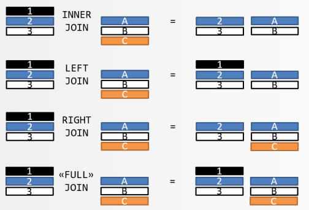

```{r setup, include = FALSE}
library(tidyverse)
library(mdsr)
library(nycflights13)
```

## What is a Join?

In many cases, we have a dataset that has been intentionally abbreviated or is 
missing key data for our analysis.  

When this happens, we join together datasets (sometimes many datasets, but at 
least 2) to ensure we can do a complete analysis. 

When we "join" data, we are matching a row (or more) from one dataset to a 
corresponding row (or more) in a second dataset. 

For example, perhaps you know how many flights per day there are from NYC area 
airports and you want to see if the weather on each day affects the departure 
rate. 

Another example, perhaps your dataset abbreviates a specific column (like an 
airport code or airline name) and another table elaborates on it. You can join 
the two together to get a complete picture.

## Explaining Joins

There are multiple types of joins. We'll be focused on Inner Joins and Left 
Joins, but it is important to understand how they work before we do them. 

<center>



</center>

## Inner Joins

Inner joins only return those results from table 1 that are in table 2 and table 
2 that are in table one.

In our `flights` data from the homework, we have a `carrier` column. Some of them 
we can infer - UA is [probably] United Airlines and AA is [probably] American 
Airlines, but what about B6?

Thankfully, there is another table with `airlines` data. 

```{r inner_join}
glimpse(flights)
head(airlines)

ij_data <- flights %>% 
    inner_join(airlines, by = c("carrier" = "carrier")) %>% 
    select(tailnum, 
           flight,
           carrier, 
           name)

nrow(ij_data)
nrow(flights)
```

This is lucky, though... Let's see how it usually is in real life.

```{r rl_inner_join}
incomplete_airlines <- airlines %>% 
    head(8)
incomplete_airlines

new_joined_data <- flights %>% 
    inner_join(incomplete_airlines, by = c("carrier" = "carrier")) %>% 
    select(tailnum, 
           flight,
           carrier, 
           name)

nrow(new_joined_data)
nrow(flights)
```

Now we see that not every row from the flights dataset is included... ONLY those 
that are in the incomplete_airlines data, too, are included. 

## Left Join

Left join will always include all of the rows from table 1, the left dataset. If 
their isn't corresponding data in table 2 (the right), it will show up as an NA, 
not be dropped.

```{r left_join_complete}
lj_data <- flights %>% 
    left_join(airlines, by = c("carrier" = "carrier")) %>% 
    select(tailnum, 
           flight,
           carrier, 
           name)

nrow(lj_data)
nrow(flights)

lj_data == ij_data
```

Here we see that the `inner_join` and the `left_join` are identical. This is 
because every row in table 1 matches to a row in table 2. Let's see what happens 
when we again use the incomplete dataset. 

```{r left_join_incomplete}
lj_joined_data <- flights %>% 
    left_join(incomplete_airlines, by = c("carrier" = "carrier")) %>% 
    select(tailnum, 
           flight,
           carrier, 
           name)

nrow(lj_joined_data)
nrow(flights)
head(lj_joined_data)
```

Now we see every row from the flights data is present, but many carrier names 
are missing.

## IN CLASS EXERCISE