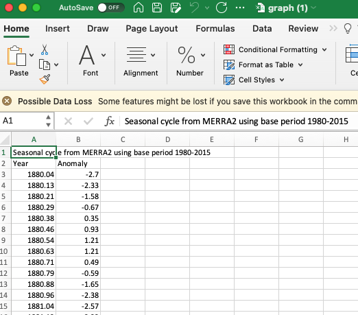
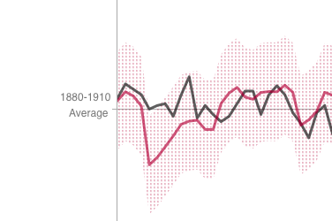
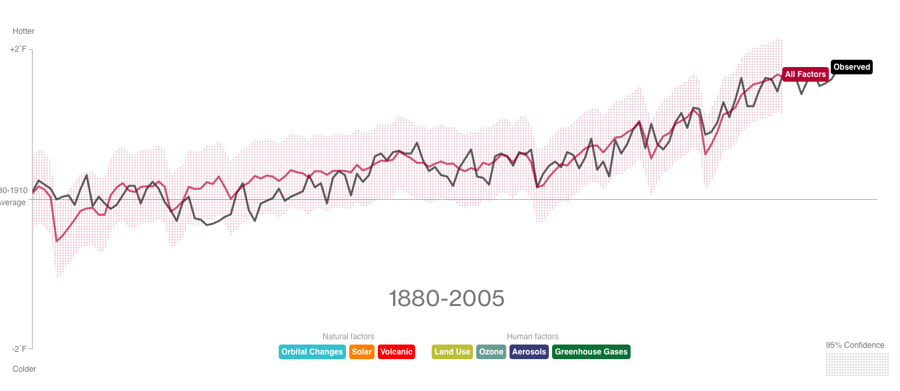

```{r setup, include = FALSE}
options(htmltools.dir.version = FALSE,
        scipen = 999)
knitr::opts_chunk$set(
  fig.retina = 3,
  cache = FALSE,
  echo = TRUE,
  message = FALSE, 
  warning = FALSE,
  hiline = TRUE
)
```

```{r xaringan-themer, include = FALSE, warning = FALSE}
library(xaringanthemer)
style_duo_accent(
  primary_color = "#1381B0",
  secondary_color = "#FF961C",
  inverse_header_color = "#FFFFFF",
  code_font_size = "0.7rem"
)
```

class: center, middle

# The Initial Data Visualization

[Let's take a look at the original.](https://www.bloomberg.com/graphics/2015-whats-warming-the-world/)

---

class: inverse, center, middle

# Data Wrangling First

---

class: left, top

# The Temperature Data

I found the temperature data, finally, on the NASA website (after clicking 
through a bunch of links). Here it is...

.pull-left[
    
]

.pull-right[
    There are some weird things I'll need to address:
    
    1. The first line isn't really part of the data
    2. The date is a wild decimal
    3. I only want one temperature deviation per year
    4. The visualization compares all temperatures  
       to the average of 1880-1910
]

---

class: left, top

# Wrangling the Temperature Data

First, let's read in the data and make sure that that worked!

.pull-left[
```{r init_temp_data, echo = TRUE}

# THE PACKAGES WE NEED!
library(tidyverse)
library(lubridate)

data_url <- paste0("https://data.giss.nasa.gov",
                   "/gistemp/graphs_v3/graph_d",
                   "ata/GISTEMP_Seasonal_Cycle",
                   "_since_1880/graph.csv")

# READ THE DATA FROM THE URL, BUT SKIP THE FIRST LINE!
temp_dat <- read_csv(data_url, skip = 1)
```
]

.pull-right[
```{r show_initial, echo = FALSE}
temp_dat
```
]

---

class: left, top

# Wrangling the Temperature Data

Second, let's convert the `Year` into an actual `Year` and then get the average 
deviation per year.

.pull-left[
```{r summarizing_data, echo = TRUE}
temp_dat <- temp_dat %>% # USING THE RAW DATA
    # TAKE THE YEAR OUT, PASTE IN THE MONTH AND DAY, 
    # THEN CONVERT IT TO A DATE
    mutate(Year = as_date(paste0(substr(Year, 1, 4), 
                                 "-01-01"))) %>% 
    # THE VIZ ONLY HAS FROM 1880-TODAY, SO LET'S 
    # FILTER THOSE DATES
    filter(Year >= as_date("1880-01-01")) %>% 
    # GROUP BY THE YEAR
    group_by(Year) %>% 
    # GIVE ME THE AVERAGE DEVIATION
    summarise(avg_temp = mean(Anomaly))
```
]

.pull-right[
```{r summary_shown, echo = FALSE}
temp_dat
```
]

---

class: left, top

# Wrangling the Temperature Data

Right... but deviation from what? Oh right, to the average of the deviations 
between 1880 and 1910 (why, I'm not sure, but we're here to recreate).

.pull-left[
    
]

.pull-left[
```{r make_comparison, echo = TRUE}
avg_1880_1910 <- as.numeric(
    temp_dat %>% # TAKE THE TEMP_DAT
        # FILTER BETWEEN 1880 AND 1910
        filter(Year >= as_date("1880-01-01") & 
                   Year < as_date("1911-01-01")) %>% 
        # THEN GET THE SUMMARY
        summarise(avg_temp = mean(avg_temp))
)

# NOW LET'S CHANGE THE PREVIOUS AVG WE CREATED TO BE COMPARED TO 
# THE AVERAGE FROM 1880-1910
temp_dat$avg_temp <- temp_dat$avg_temp - avg_1880_1910
```
]

---

class: left, top

# Wrangling the Temperature Data

Now, how do we look? 

.pull-left[
    
]

.pull-right[
```{r compare_temp, echo = TRUE, fig.height = 3}
ggplot(temp_dat, aes(x = Year, y = avg_temp)) + 
    geom_line() + 
    geom_hline(yintercept = 0)
```
]

---

class: left, top

# Wrangling the Causes Data

Let's take a look at the causes data. I am not sure what scale these are on, 
but we'll need to again create the average for 1880-1910 and compare to that. 
We will also need to limit our results to 1880-2005.

.pull-left[
```{r get_causes, echo = TRUE}
data_url <- paste0("https://www.bloomberg.com/",
                   "graphics/2015-whats-warming",
                   "-the-world/data/forcings.csv")

causes_dat <- read_csv(data_url)
```
]

.pull-right[
```{r show_causes, echo = FALSE}
causes_dat
```
]

---

class: left, top

# Wrangling the Causes Data

Creating the comparison data.

.pull-left[
```{r creating_comparison, echo = TRUE}
cause_comparison <- causes_dat %>% 
    filter(Year >= 1880 & 
               Year <= 1910) %>%
    summarise(all_factors = mean(`All forcings`),
              human_factors = mean(Human),
              natural_factors = mean(Natural),
              orbital = mean(`Orbital changes`),
              solar = mean(Solar),
              volcanic = mean(Volcanic), 
              land_use = mean(`Land use`),
              ozone = mean(Ozone), 
              aerosol = mean(`Anthropogenic tropospheric aerosol`),
              greenhouse_gas = mean(`Greenhouse gases`))
```
]

.pull-right[
```{r comparison_show, echo = FALSE}
cause_comparison
```

In case there is any concern, the data is rounded to show. It is really a 
decimal. 

```{r decimal, echo = TRUE}
cause_comparison$aerosol
```
]

---

class: left, top

# Wrangling the Causes Data

We'll learn about joining tables next week, but let's combine the tables and 
create the comparisons we're expecting.

.pull-left[
```{r join_and_mutate, echo = TRUE}
cause_final <- causes_dat %>% 
    filter(Year >= 1880 & 
               Year <= 2005) %>% 
    bind_cols(cause_comparison) %>% 
    mutate(Year = as_date(paste0(Year, "-01-01")),
           all_factors = `All forcings` - all_factors,
           human_factors = Human - human_factors,
           natural_factors = Natural - natural_factors,
           orbital = `Orbital changes` - orbital,
           solar = Solar - solar,
           volcanic = Volcanic - volcanic,
           land_use = `Land use` - land_use,
           ozone = Ozone - ozone,
           aerosol = `Anthropogenic tropospheric aerosol` - aerosol,
           greenhouse_gas = `Greenhouse gases` - greenhouse_gas) %>% 
    select(Year, 
           all_factors,
           natural_factors,
           human_factors,
           orbital,
           solar, 
           volcanic,
           land_use,
           ozone,
           aerosol, 
           greenhouse_gas)
```
]

.pull_right[
```{r show_final_cause, echo = FALSE}
cause_final
```
]

---

class: left, top

# Creating the Data Set to Plot

Now we have temperature data and causes data, but in two datasets. Let's join 
them jawns and then we'll be good to go!

.pull-left[
```{r join_datasets, echo = TRUE}
plot_data <- temp_dat %>% 
    left_join(cause_final, by = "Year")
```
]

.pull-right[
```{r show_joined, echo = FALSE}
plot_data
```
]

---

class: inverse, center, middle

# Now the Data Viz!

---

class: center, top

# What's Really Warming the World?

Not too shabby!

```{r observed_temp, echo = FALSE, out.width = "100%", fig.height = 3}
ggplot(plot_data, aes(x = Year)) +
    geom_line(aes(y = avg_temp), color = "#565656") +
    geom_hline(yintercept = 0, size = 0.25) + 
    geom_curve(aes(x = as_date("1965-01-01"), 
                   xend = as_date("1956-01-01"), 
                   y = -0.25, 
                   yend = plot_data$avg_temp[plot_data$Year == as_date("1956-01-01")] - 0.05), 
               curvature = -0.35, 
               arrow = arrow(length = unit(0.1, "inches"))) +
    annotate("text", 
             x = as_date("1965-01-01"), 
             y = -0.25, 
             label = paste0("This line shows the measured, or\n \"observed,\" ",
                            "land-ocean temperature"),
             color = "#565656", 
             size = 2, 
             hjust = 0) + 
    annotate("text", 
             x = as_date("1880-01-01"), 
             y = -0.1, 
             label = paste0("1880-1910\nAverage"),
             color = "#565656", 
             size = 2) + 
    annotate("text", 
             x = as_date("1947-01-01"), 
             y = -1, 
             label = paste0("1880-2014"),
             color = "#565656", 
             size = 8) + 
    geom_label(aes(x = max(plot_data$Year), 
                   y = plot_data$avg_temp[plot_data$Year == max(plot_data$Year)],
                   label = "Observed"),
               size = 2, 
               fill = "black",
               color = "white", 
               hjust = 0) + 
    scale_y_continuous(limits = c(-2, 2), 
                       breaks = c(-2, 2), 
                       labels = c("-2°F", "2°F")) + 
    scale_x_date(limits = c(min(plot_data$Year), max(plot_data$Year) + years(7))) + 
    theme(panel.background = element_blank(),
          panel.grid = element_blank(),
          axis.ticks.y = element_line(size = 0.25),
          axis.line.y = element_line(color = "black", size = 0.25),
          axis.title = element_blank(),
          axis.text.x = element_blank(),
          axis.ticks.x = element_blank())
```

---

class: center, top

# What's Really Warming the World?

What did it take to create that? Quite a bit! This code is available to you in 
the drive... 

```{r observed_temp_show, echo = TRUE, eval = FALSE}
ggplot(plot_data, aes(x = Year)) +
    geom_line(aes(y = avg_temp), color = "#565656") +
    geom_hline(yintercept = 0, size = 0.25) + 
    geom_curve(aes(x = as_date("1965-01-01"), 
                   xend = as_date("1956-01-01"), 
                   y = -0.25, 
                   yend = plot_data$avg_temp[plot_data$Year == as_date("1956-01-01")] - 0.05), 
               curvature = -0.35, 
               arrow = arrow(length = unit(0.1, "inches"))) +
    annotate("text", 
             x = as_date("1965-01-01"), 
             y = -0.25, 
             label = paste0("This line shows the measured, or\n \"observed,\" ",
                            "land-ocean temperature"),
             color = "#565656", 
             size = 2, 
             hjust = 0) + 
    annotate("text", 
             x = as_date("1880-01-01"), 
             y = -0.1, 
             label = paste0("1880-1910\nAverage"),
             color = "#565656", 
             size = 2) + 
    annotate("text", 
             x = as_date("1947-01-01"), 
             y = -1, 
             label = paste0("1880-2014"),
             color = "#565656", 
             size = 8) + 
    geom_label(aes(x = max(plot_data$Year), 
                   y = plot_data$avg_temp[plot_data$Year == max(plot_data$Year)],
                   label = "Observed"),
               size = 2, 
               fill = "black",
               color = "white", 
               hjust = 0) + 
    scale_y_continuous(limits = c(-2, 2), 
                       breaks = c(-2, 2), 
                       labels = c("-2°F", "2°F")) + 
    scale_x_date(limits = c(min(plot_data$Year), max(plot_data$Year) + years(7))) + 
    theme(panel.background = element_blank(),
          panel.grid = element_blank(),
          axis.ticks.y = element_line(size = 0.25),
          axis.line.y = element_line(color = "black", size = 0.25),
          axis.title = element_blank(),
          axis.text.x = element_blank(),
          axis.ticks.x = element_blank())
```

---

class: center, top

# Is it the Earth's Orbit?

Nope. 

```{r earths_orbit, echo = FALSE, out.width = "100%", fig.height = 3}
ggplot(plot_data, aes(x = Year)) +
    geom_line(aes(y = avg_temp), color = "#565656") +
    geom_line(aes(y = orbital), color = "#00f6f6") +
    geom_hline(yintercept = 0, size = 0.25) + 
    geom_curve(aes(x = as_date("2004-01-01"), 
                   xend = as_date("2004-01-01"), 
                   y = -1, 
                   yend = -0.25), 
               curvature = 0.5, 
               arrow = arrow(length = unit(0.1, "inches"))) + 
    annotate("text", 
             x = as_date("2004-01-01"), 
             y = -1, 
             label = paste0("I didn't find any confidence\n",
                            "interval data, so it isn't here"),
             color = "#565656", 
             size = 2, 
             hjust = 1) + 
    annotate("text", 
             x = as_date("1880-01-01"), 
             y = -0.1, 
             label = paste0("1880-1910\nAverage"),
             color = "#565656", 
             size = 2) + 
    annotate("text", 
             x = as_date("1947-01-01"), 
             y = -1, 
             label = paste0("1880-2005"),
             color = "#565656", 
             size = 8) + 
    geom_label(aes(x = max(plot_data$Year), 
                   y = plot_data$avg_temp[plot_data$Year == max(plot_data$Year)],
                   label = "Observed"),
               size = 2, 
               fill = "black",
               color = "white", 
               hjust = 0) + 
    geom_label(aes(x = max(plot_data$Year[!is.na(plot_data$orbital)]), 
                   y = plot_data$orbital[
                       plot_data$Year == max(plot_data$Year[!is.na(plot_data$orbital)])],
                   label = "Orbital Changes"),
               size = 2, 
               fill = "#00f6f6",
               color = "white", 
               hjust = 0) + 
    scale_y_continuous(limits = c(-2, 2), 
                       breaks = c(-2, 2), 
                       labels = c("-2°F", "2°F")) + 
    scale_x_date(limits = c(min(plot_data$Year), max(plot_data$Year) + years(7))) + 
    theme(panel.background = element_blank(),
          panel.grid = element_blank(),
          axis.ticks.y = element_line(size = 0.25),
          axis.line.y = element_line(color = "black", size = 0.25),
          axis.title = element_blank(),
          axis.text.x = element_blank(),
          axis.ticks.x = element_blank())
```


---

class: center, top

# Is it the Sun?

Nope. 

```{r solar, echo = FALSE, out.width = "100%", fig.height = 3}
ggplot(plot_data, aes(x = Year)) +
    geom_line(aes(y = avg_temp), color = "#565656") +
    geom_line(aes(y = solar), color = "#ffa500") +
    geom_hline(yintercept = 0, size = 0.25) + 
    annotate("text", 
             x = as_date("1880-01-01"), 
             y = -0.1, 
             label = paste0("1880-1910\nAverage"),
             color = "#565656", 
             size = 2) + 
    annotate("text", 
             x = as_date("1947-01-01"), 
             y = -1, 
             label = paste0("1880-2005"),
             color = "#565656", 
             size = 8) + 
    geom_label(aes(x = max(plot_data$Year), 
                   y = plot_data$avg_temp[plot_data$Year == max(plot_data$Year)],
                   label = "Observed"),
               size = 2, 
               fill = "black",
               color = "white", 
               hjust = 0) + 
    geom_label(aes(x = max(plot_data$Year[!is.na(plot_data$solar)]), 
                   y = plot_data$solar[
                       plot_data$Year == max(plot_data$Year[!is.na(plot_data$solar)])],
                   label = "Solar"),
               size = 2, 
               fill = "#ffa500",
               color = "white", 
               hjust = 0) + 
    scale_y_continuous(limits = c(-2, 2), 
                       breaks = c(-2, 2), 
                       labels = c("-2°F", "2°F")) + 
    scale_x_date(limits = c(min(plot_data$Year), max(plot_data$Year) + years(7))) + 
    theme(panel.background = element_blank(),
          panel.grid = element_blank(),
          axis.ticks.y = element_line(size = 0.25),
          axis.line.y = element_line(color = "black", size = 0.25),
          axis.title = element_blank(),
          axis.text.x = element_blank(),
          axis.ticks.x = element_blank())
```

---

class: center, top

# Is it the Volcanoes?

Nope. 

```{r volcanoes, echo = FALSE, out.width = "100%", fig.height = 3}
ggplot(plot_data, aes(x = Year)) +
    geom_line(aes(y = avg_temp), color = "#565656") +
    geom_line(aes(y = volcanic), color = "#ff4d4d") +
    geom_hline(yintercept = 0, size = 0.25) + 
    annotate("text", 
             x = as_date("1880-01-01"), 
             y = -0.1, 
             label = paste0("1880-1910\nAverage"),
             color = "#565656", 
             size = 2) + 
    annotate("text", 
             x = as_date("1947-01-01"), 
             y = -1, 
             label = paste0("1880-2005"),
             color = "#565656", 
             size = 8) + 
    geom_label(aes(x = max(plot_data$Year), 
                   y = plot_data$avg_temp[plot_data$Year == max(plot_data$Year)],
                   label = "Observed"),
               size = 2, 
               fill = "black",
               color = "white", 
               hjust = 0) + 
    geom_label(aes(x = max(plot_data$Year[!is.na(plot_data$volcanic)]), 
                   y = plot_data$volcanic[
                       plot_data$Year == max(plot_data$Year[!is.na(plot_data$volcanic)])],
                   label = "Volcanic"),
               size = 2, 
               fill = "#ff4d4d",
               color = "white", 
               hjust = 0) + 
    scale_y_continuous(limits = c(-2, 2), 
                       breaks = c(-2, 2), 
                       labels = c("-2°F", "2°F")) + 
    scale_x_date(limits = c(min(plot_data$Year), max(plot_data$Year) + years(7))) + 
    theme(panel.background = element_blank(),
          panel.grid = element_blank(),
          axis.ticks.y = element_line(size = 0.25),
          axis.line.y = element_line(color = "black", size = 0.25),
          axis.title = element_blank(),
          axis.text.x = element_blank(),
          axis.ticks.x = element_blank())
```

---

class: center, top

# Is it all Three of These Things Combined?

Nope. 

```{r all_3, echo = FALSE, out.width = "100%", fig.height = 3}
ggplot(plot_data, aes(x = Year)) +
    geom_line(aes(y = avg_temp), color = "#565656") +
    geom_line(aes(y = natural_factors), color = "#749a00") +
    geom_hline(yintercept = 0, size = 0.25) + 
    annotate("text", 
             x = as_date("1880-01-01"), 
             y = -0.1, 
             label = paste0("1880-1910\nAverage"),
             color = "#565656", 
             size = 2) + 
    annotate("text", 
             x = as_date("1947-01-01"), 
             y = -1, 
             label = paste0("1880-2005"),
             color = "#565656", 
             size = 8) + 
    geom_label(aes(x = max(plot_data$Year), 
                   y = plot_data$avg_temp[plot_data$Year == max(plot_data$Year)],
                   label = "Observed"),
               size = 2, 
               fill = "black",
               color = "white", 
               hjust = 0) + 
    geom_label(aes(x = max(plot_data$Year[!is.na(plot_data$natural_factors)]), 
                   y = plot_data$natural_factors[
                       plot_data$Year == max(plot_data$Year[!is.na(plot_data$natural_factors)])],
                   label = "Natural Factors"),
               size = 2, 
               fill = "#749a00",
               color = "white", 
               hjust = 0) + 
    scale_y_continuous(limits = c(-2, 2), 
                       breaks = c(-2, 2), 
                       labels = c("-2°F", "2°F")) + 
    scale_x_date(limits = c(min(plot_data$Year), max(plot_data$Year) + years(7))) + 
    theme(panel.background = element_blank(),
          panel.grid = element_blank(),
          axis.ticks.y = element_line(size = 0.25),
          axis.line.y = element_line(color = "black", size = 0.25),
          axis.title = element_blank(),
          axis.text.x = element_blank(),
          axis.ticks.x = element_blank())
```


---

class: center, top

# So it it's not Nature, is it Deforestation?

Nope. 

```{r land_use, echo = FALSE, out.width = "100%", fig.height = 3}
ggplot(plot_data, aes(x = Year)) +
    geom_line(aes(y = avg_temp), color = "#565656") +
    geom_line(aes(y = land_use), color = "#bf9600") +
    geom_hline(yintercept = 0, size = 0.25) + 
    annotate("text", 
             x = as_date("1880-01-01"), 
             y = -0.1, 
             label = paste0("1880-1910\nAverage"),
             color = "#565656", 
             size = 2) + 
    annotate("text", 
             x = as_date("1947-01-01"), 
             y = -1, 
             label = paste0("1880-2005"),
             color = "#565656", 
             size = 8) + 
    geom_label(aes(x = max(plot_data$Year), 
                   y = plot_data$avg_temp[plot_data$Year == max(plot_data$Year)],
                   label = "Observed"),
               size = 2, 
               fill = "black",
               color = "white", 
               hjust = 0) + 
    geom_label(aes(x = max(plot_data$Year[!is.na(plot_data$land_use)]), 
                   y = plot_data$land_use[
                       plot_data$Year == max(plot_data$Year[!is.na(plot_data$land_use)])],
                   label = "Land Use"),
               size = 2, 
               fill = "#bf9600",
               color = "white", 
               hjust = 0) + 
    scale_y_continuous(limits = c(-2, 2), 
                       breaks = c(-2, 2), 
                       labels = c("-2°F", "2°F")) + 
    scale_x_date(limits = c(min(plot_data$Year), max(plot_data$Year) + years(7))) + 
    theme(panel.background = element_blank(),
          panel.grid = element_blank(),
          axis.ticks.y = element_line(size = 0.25),
          axis.line.y = element_line(color = "black", size = 0.25),
          axis.title = element_blank(),
          axis.text.x = element_blank(),
          axis.ticks.x = element_blank())
```


---

class: center, top

# Or Aerosol Polution?

Nope. 

```{r aerosol, echo = FALSE, out.width = "100%", fig.height = 3}
ggplot(plot_data, aes(x = Year)) +
    geom_line(aes(y = avg_temp), color = "#565656") +
    geom_line(aes(y = aerosol), color = "#6699cc") +
    geom_hline(yintercept = 0, size = 0.25) + 
    annotate("text", 
             x = as_date("1880-01-01"), 
             y = -0.1, 
             label = paste0("1880-1910\nAverage"),
             color = "#565656", 
             size = 2) + 
    annotate("text", 
             x = as_date("1947-01-01"), 
             y = -1, 
             label = paste0("1880-2005"),
             color = "#565656", 
             size = 8) + 
    geom_label(aes(x = max(plot_data$Year), 
                   y = plot_data$avg_temp[plot_data$Year == max(plot_data$Year)],
                   label = "Observed"),
               size = 2, 
               fill = "black",
               color = "white", 
               hjust = 0) + 
    geom_label(aes(x = max(plot_data$Year[!is.na(plot_data$aerosol)]), 
                   y = plot_data$aerosol[
                       plot_data$Year == max(plot_data$Year[!is.na(plot_data$aerosol)])],
                   label = "Aerosols"),
               size = 2, 
               fill = "#6699cc",
               color = "white", 
               hjust = 0) + 
    scale_y_continuous(limits = c(-2, 2), 
                       breaks = c(-2, 2), 
                       labels = c("-2°F", "2°F")) + 
    scale_x_date(limits = c(min(plot_data$Year), max(plot_data$Year) + years(7))) + 
    theme(panel.background = element_blank(),
          panel.grid = element_blank(),
          axis.ticks.y = element_line(size = 0.25),
          axis.line.y = element_line(color = "black", size = 0.25),
          axis.title = element_blank(),
          axis.text.x = element_blank(),
          axis.ticks.x = element_blank())
```


---

class: center, top

# No, it Really is Greenhouse Gases


```{r greenhouse, echo = FALSE, out.width = "100%", fig.height = 3}
ggplot(plot_data, aes(x = Year)) +
    geom_line(aes(y = avg_temp), color = "#565656") +
    geom_line(aes(y = greenhouse_gas), color = "#228b22") +
    geom_hline(yintercept = 0, size = 0.25) + 
    annotate("text", 
             x = as_date("1880-01-01"), 
             y = -0.1, 
             label = paste0("1880-1910\nAverage"),
             color = "#565656", 
             size = 2) + 
    annotate("text", 
             x = as_date("1947-01-01"), 
             y = -1, 
             label = paste0("1880-2005"),
             color = "#565656", 
             size = 8) + 
    geom_label(aes(x = max(plot_data$Year), 
                   y = plot_data$avg_temp[plot_data$Year == max(plot_data$Year)],
                   label = "Observed"),
               size = 2, 
               fill = "black",
               color = "white", 
               hjust = 0) + 
    geom_label(aes(x = max(plot_data$Year[!is.na(plot_data$greenhouse_gas)]), 
                   y = plot_data$greenhouse_gas[
                       plot_data$Year == max(plot_data$Year[!is.na(plot_data$greenhouse_gas)])],
                   label = "Greenhouse Gases"),
               size = 2, 
               fill = "#228b22",
               color = "white", 
               hjust = 0.5,
               vjust = 0) + 
    scale_y_continuous(limits = c(-2, 2), 
                       breaks = c(-2, 2), 
                       labels = c("-2°F", "2°F")) + 
    scale_x_date(limits = c(min(plot_data$Year), max(plot_data$Year) + years(7))) + 
    theme(panel.background = element_blank(),
          panel.grid = element_blank(),
          axis.ticks.y = element_line(size = 0.25),
          axis.line.y = element_line(color = "black", size = 0.25),
          axis.title = element_blank(),
          axis.text.x = element_blank(),
          axis.ticks.x = element_blank())
```


---

class: center, top

# See for Yourself


```{r human, echo = FALSE, out.width = "100%", fig.height = 3}
ggplot(plot_data, aes(x = Year)) +
    geom_line(aes(y = avg_temp), color = "#565656") +
    geom_line(aes(y = human_factors), color = "blue") +
    geom_hline(yintercept = 0, size = 0.25) + 
    annotate("text", 
             x = as_date("1880-01-01"), 
             y = -0.1, 
             label = paste0("1880-1910\nAverage"),
             color = "#565656", 
             size = 2) + 
    annotate("text", 
             x = as_date("1947-01-01"), 
             y = -1, 
             label = paste0("1880-2005"),
             color = "#565656", 
             size = 8) + 
    geom_label(aes(x = max(plot_data$Year), 
                   y = plot_data$avg_temp[plot_data$Year == max(plot_data$Year)],
                   label = "Observed"),
               size = 2, 
               fill = "black",
               color = "white", 
               hjust = 0) + 
    geom_label(aes(x = max(plot_data$Year[!is.na(plot_data$human_factors)]), 
                   y = plot_data$human_factors[
                       plot_data$Year == max(plot_data$Year[!is.na(plot_data$human_factors)])],
                   label = "Human Factors"),
               size = 2, 
               fill = "blue",
               color = "white", 
               hjust = 0) + 
    scale_y_continuous(limits = c(-2, 2), 
                       breaks = c(-2, 2), 
                       labels = c("-2°F", "2°F")) + 
    scale_x_date(limits = c(min(plot_data$Year), max(plot_data$Year) + years(7))) + 
    theme(panel.background = element_blank(),
          panel.grid = element_blank(),
          axis.ticks.y = element_line(size = 0.25),
          axis.line.y = element_line(color = "black", size = 0.25),
          axis.title = element_blank(),
          axis.text.x = element_blank(),
          axis.ticks.x = element_blank())
```


---

class: center, top

# All Factors


```{r all_factors, echo = FALSE, out.width = "100%", fig.height = 3}
ggplot(plot_data, aes(x = Year)) +
    geom_line(aes(y = avg_temp), color = "#565656") +
    geom_line(aes(y = all_factors), color = "#8b0000") +
    geom_hline(yintercept = 0, size = 0.25) + 
    annotate("text", 
             x = as_date("1880-01-01"), 
             y = -0.1, 
             label = paste0("1880-1910\nAverage"),
             color = "#565656", 
             size = 2) + 
    annotate("text", 
             x = as_date("1947-01-01"), 
             y = -1, 
             label = paste0("1880-2005"),
             color = "#565656", 
             size = 8) + 
    geom_label(aes(x = max(plot_data$Year), 
                   y = plot_data$avg_temp[plot_data$Year == max(plot_data$Year)],
                   label = "Observed"),
               size = 2, 
               fill = "black",
               color = "white", 
               hjust = 0) + 
    geom_label(aes(x = max(plot_data$Year[!is.na(plot_data$all_factors)]), 
                   y = plot_data$all_factors[
                       plot_data$Year == max(plot_data$Year[!is.na(plot_data$all_factors)])],
                   label = "All Factors"),
               size = 2, 
               fill = "#8b0000",
               color = "white", 
               hjust = 0) + 
    scale_y_continuous(limits = c(-2, 2), 
                       breaks = c(-2, 2), 
                       labels = c("-2°F", "2°F")) + 
    scale_x_date(limits = c(min(plot_data$Year), max(plot_data$Year) + years(7))) + 
    theme(panel.background = element_blank(),
          panel.grid = element_blank(),
          axis.ticks.y = element_line(size = 0.25),
          axis.line.y = element_line(color = "black", size = 0.25),
          axis.title = element_blank(),
          axis.text.x = element_blank(),
          axis.ticks.x = element_blank())
```


